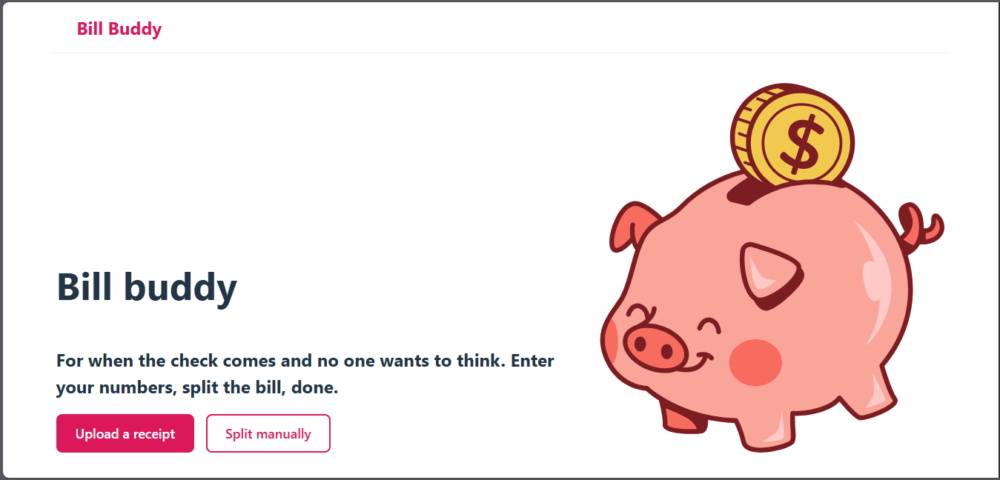

# 💸 BillBuddy

**BillBuddy** is a smart receipt-splitting app built with **React + Node.js** and powered by the **Google Cloud Vision API**.
Upload any restaurant or store receipt, and BillBuddy automatically scans, itemizes, and helps you split the bill fairly among friends — no more math, confusion, or awkward moments.
> 🪄 P.S. Hover my name in the footnotes for a cool surprise.

---

## ✨ Features
- 🧾 Receipt OCR — Upload photos and extract item details automatically
- 👥 Smart Split — Divide totals evenly or assign custom items per person
- 💬 Item Notes & Adjustments — Add tips, discounts, or shared extras
- ☁️ Google Cloud Vision Integration — Accurate, fast text recognition
- 🚀 Continuous Deployment via Vercel  

---

## 🚀 Getting Started

### Clone the repo
```bash
git clone https://github.com/rxshellg/bill-buddy.git
cd bill-buddy 
```

### Install dependencies
```bash
npm install
```

### Set up environment variables
Create an .env file in the project root and add your credentials:
```bash
GOOGLE_VISION_CREDENTIALS=your_api_key_here
```

### Run locally
```bash
npm run dev
```

### Build for production
```bash
npm run build
```

---

## 🖼️ Screenshots / Demo

